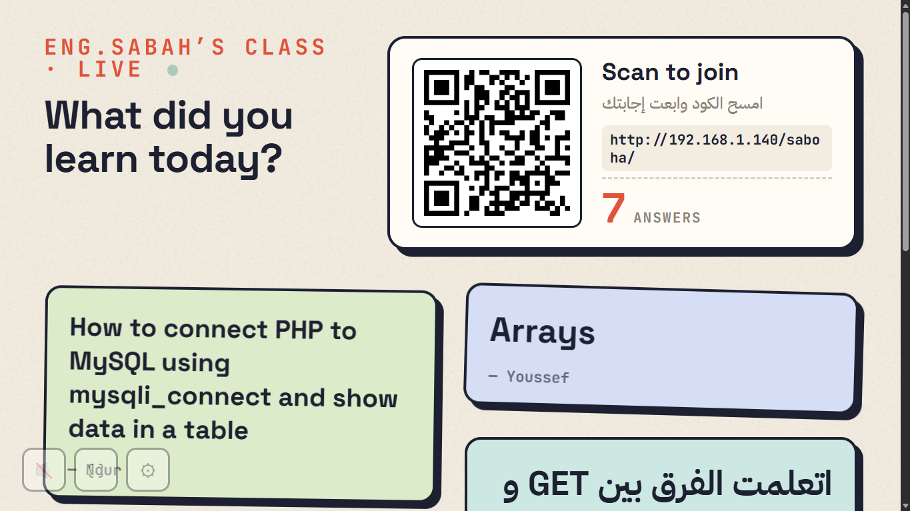
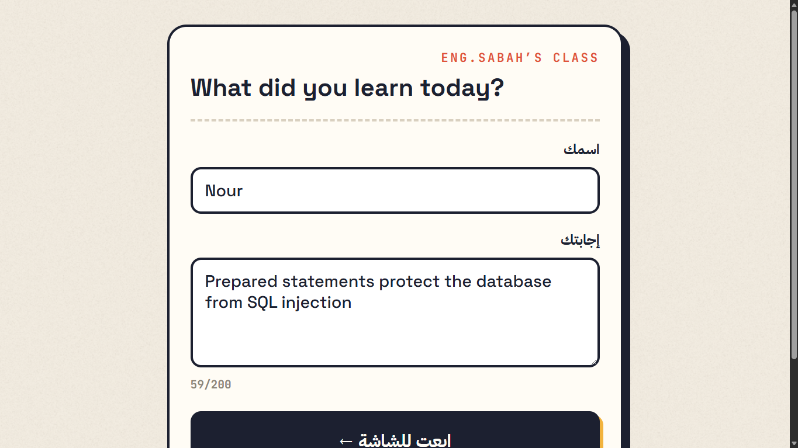
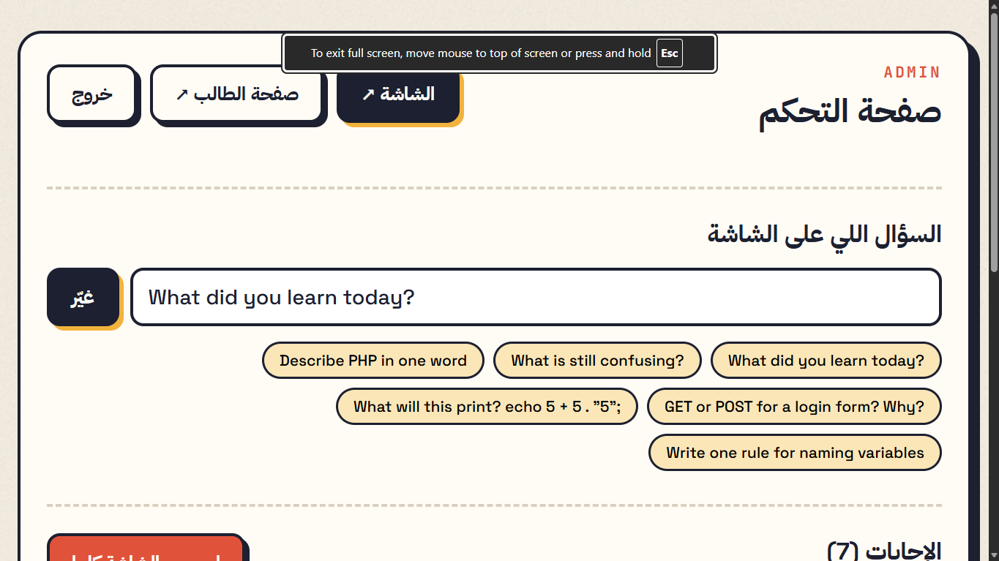

# Class Wall: Live Classroom Response Board

Students scan a QR code on the projector, type an answer on their phones, and it appears on the big screen live. I built it with plain PHP and MySQL to use in my own web programming classes.

## Features

- **QR join.** The wall shows a QR code with the student page URL, generated automatically from the machine's local IP address.
- **Live updates.** The wall polls a JSON API every 2 seconds with `fetch`. New answers pop in and deleted ones fade out, with no page reload.
- **Student page.** A mobile-first form with server-side validation and a live character counter. It remembers the student's name in a cookie.
- **Admin panel.** It is protected by a PIN and a session. From it the teacher can change the question (or pick a preset), delete single answers, or clear the board.
- **Bilingual.** Arabic and English text with automatic direction (`dir="auto"`). The fonts are stored locally, so the app works offline on a classroom LAN.

## Security

- **SQL injection:** every query that takes user input uses a **prepared statement** (`mysqli_prepare` + `bind_param`).
- **XSS:** all output goes through `htmlspecialchars`, and the wall renders answers with `textContent`.
- **Validation:** it happens on the server; the client-side checks are only for convenience.
- **Repeated submits:** forms use the Post/Redirect/Get pattern, so refreshing the page doesn't resubmit.

## Tech Stack

PHP · MySQL · JavaScript (Fetch API) · HTML5 · CSS3

| File | Role |
| --- | --- |
| `config.php` | Settings (DB credentials, class name, admin PIN) |
| `db.php` | DB connection and helper functions |
| `setup.php` | Creates the database and tables (run it once) |
| `index.php` | Student answer form (INSERT) |
| `api.php` | JSON endpoint the wall polls (SELECT) |
| `wall.php` | Projector screen |
| `admin.php` | Teacher control panel (UPDATE / DELETE) |

## Run Locally (XAMPP)

1. Copy the folder into `C:\xampp\htdocs\class-wall`.
2. Start **Apache** and **MySQL** from the XAMPP Control Panel.
3. Open `http://localhost/class-wall/setup.php` once.
4. Open `http://localhost/class-wall/wall.php` on the projector.
5. Students on the same Wi-Fi scan the QR code.

The admin panel is at `/admin.php`. The default PIN is `1234`; change it in `config.php`.

## Screenshots

| Student page | Admin panel |
| --- | --- |
|  |  |

---

Built by **Eng. Sabah Gomaa**: [GitHub](https://github.com/Engsabah37) · [LinkedIn](https://linkedin.com/in/sabah-gomaa-90a8361b7)
